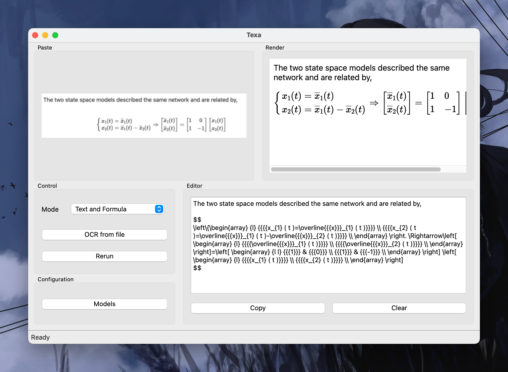

# Texa

A cross-plaform GUI wrapper for [Pix2Text](https://github.com/breezedeus/Pix2Text), powered by PySide6

## Feature

- Realtime LaTeX rendering with [MathJax](https://www.mathjax.org)
- Support input from file or clipboard (use the paste keyboard shortcut based on your operating system)
- Basic model management, can import customized or purchased pro model

## Installation

For Unix, run `make pyinstaller` to generate the app

For Windows, run the command under `pyinstaller:` in `Makefile` to generate the app

> _App release will be limited due to the large bundle size_
