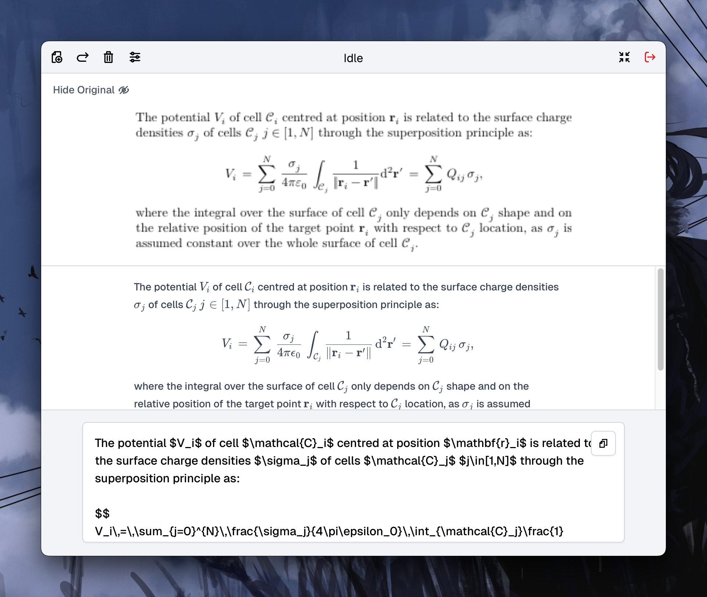

# Texa

A cross-platform GUI wrapper for [texify](https://github.com/VikParuchuri/texify), built with [SolidJS](https://www.solidjs.com) and [pywebview](https://pywebview.flowrl.com)

## Features

- Complete offline inference on CPU, powered by [ONNXRuntime](https://onnxruntime.ai)
- Realtime LaTeX and markdown rendering with [micromark](https://github.com/micromark/micromark) and [KaTeX](https://github.com/KaTeX/KaTeX)
- Support image input from file, clipboard or drop in
- Smmoth animation by [GSAP](https://gsap.com)
- Basic model management, can download necessary files online or import them manually
- Small bundle size(~90MB)

## Build

### Requirements

- Node.js 18/20+
- Python 3.11

### Steps

For macOS, run `build_macos.sh` to build the app

For Windows, run `build_windows.ps1` to build the app

> _App release will be limited, If you encounter issues using the version downloaded from the release, it is recommended to build your own copy_

> _Windows user should have [Edge WebView2 Runtime](https://developer.microsoft.com/en-us/microsoft-edge/webview2/?form=MA13LH) Installed_
